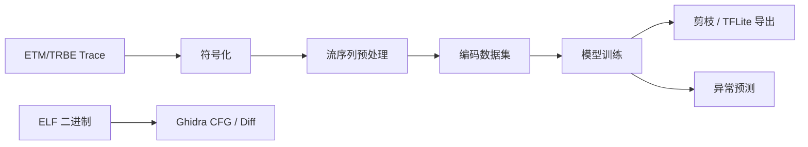

# ETM/TRBE 控制流异常检测

本项目把 ETM/TRBE Trace 转换为结构化控制流序列，训练下一跳预测模型，并通过低概率事件的滑动窗口统计检测异常。仓库同时包含基于 Ghidra/PyGhidra 的静态 CFG 提取与二进制差异分析工具。

## 数据流程



## 目录结构

```text
configs/                 默认运行配置
src/etm_flow/
  trace/                 ETM/TRBE 解码与符号化
  data/                  流序列预处理与数据集编码
  modeling/              训练、剪枝、推理、TFLite 导出和模型定义
tools/ghidra/             Ghidra/PyGhidra CFG 提取与二进制 Diff 工具
tests/                    不依赖大数据和模型文件的快速测试
docs/                     架构与维护文档
output/                   本地生成结果，不提交 Git
```

详细的模块边界和维护约定见 [docs/architecture.md](docs/architecture.md)。

## 安装

推荐使用 Python 3.9 以上版本和独立虚拟环境：

```bash
python -m venv .venv
```

激活环境后，根据用途安装：

```bash
# 完整开发环境：Trace 解析、TensorFlow 和测试工具
python -m pip install -e ".[trace,ml,dev]"
```

如果只处理已经生成的结构化数据，可以先安装基础包：

```bash
python -m pip install -e .
```

## 常用命令

```bash
# 1. 查看 Trace 符号化参数
etm-symbolize --help

# 多模块场景应同时配置主程序和所有文件型可执行共享库
etm-symbolize --trace <trace.txt> --maps <maps.txt> \
  --module-config <modules.json> --out <symbolized.jsonl>

# 2. 将符号化 JSONL 转换为保留丢包/冲突证据的控制流序列（默认）
etm-preprocess --input <symbolized.jsonl> --output-dir flow_preprocessed

# 如需复现实验中的旧版严格过滤行为
etm-preprocess --input <symbolized.jsonl> --output-dir flow_strict \
  --recovery-policy strict

# 3. 构建训练数据集
etm-build-dataset --input flow_preprocessed --recursive --output-dir flow_dataset

# 4. 训练与推理（默认读取 configs/default.yaml）
etm-train
etm-predict

# 5. 模型剪枝和便携 TFLite 导出
etm-compress
etm-export-tflite
```

配置中的相对路径均以执行命令时所在目录为基准，因此建议始终在仓库根目录运行命令。

## 恢复策略与异常证据

预处理默认使用 `evidence` 策略。它不会把 ROP 或 Address 包丢失造成的异常路径静默删除：

- 软件返回栈推测的 `RET` 目标在被后续真实指令范围确认前标记为 `speculative`；预测目标与实际重同步地址不一致时标记为 `conflict`，并保留 `expected_pc` 与 `observed_pc`。
- 目标不可恢复的控制转移仍保留控制类型，但目的地址写成 `<UNKNOWN_TARGET>`。
- `flow_gap`/overflow 写成显式 `<GAP>` token；重同步后的第一条跨断点转移标记为 `after_gap`，不会伪装成连续路径。
- maps 中存在但没有配置 ELF 的可执行模块写成带模块名和文件相对偏移的 `<opaque>` gap，不再与普通丢包混为同一个无身份节点。

软件返回栈之后、真实 Address 锚点之前的传递路径会标记为 `path_confidence=speculative`。这能避免“ROP 改写了真实返回目标，同时纠正该目标的 Address 包又丢失”时，把沿错误预测地址解出的路径误当作真值。

数据集会生成 `target_valid.dat`、`control_valid.dat`、`transition_valid.dat` 和 `is_gap.dat`。训练时，未知目的地址只屏蔽目的地址损失，控制类型仍参与训练；推测路径和跨丢包边界的样本全部屏蔽。推理报告会分别写成 `unscored_speculative_path` 或 `unscored_discontinuous_transition`，其他有效片段继续正常打分。因此训练集和真实测试数据应采用同一套默认策略，训练集还应覆盖正常采集条件下的典型丢包率；不要把 ROP 样本作为正常噪声注入训练集。

上述字段改变了符号化事件、数据集格式和词表。升级后必须从 `etm-symbolize` 开始重新生成数据，再运行 `etm-preprocess`、`etm-build-dataset` 并重新训练模型；旧的 JSONL、`.dat` 数据集和旧模型不能直接混用。

带上述模块与恢复证据字段的符号化格式版本为 `2.8.0`，预处理片段的 `schema_version` 为 `3`，编码数据集的 `format_version` 为 `4`。

## 多模块与模型输入

ROP gadget 可能来自主程序、libc、动态链接器或业务 `.so`。这些模块必须使用同一次运行的 maps 和完全匹配的 ELF 一起配置；stripped ELF 也可以用于反汇编，无符号位置使用稳定的模块相对 ELF 地址表示。模块配置格式可参考 `configs/modules.example.json`。

模型使用八路因子化输入：

```text
src_module, src_ctrl_func, src_ctrl_off, ctrl_type,
dst_module, dst_func, dst_off, icount
```

已经验证冗余的 `entry_func`、`entry_off` 不再编码。历史目的地拆分成 module/function/offset，联合的 `module::function@offset` 节点只作为 `next_dst_node` 预测标签。源和目标共享 module、function、offset embedding，能够直接学习跨模块转移，同时避免把同名函数或 stripped 共享库位置合并。

## Ghidra 工具

Ghidra 工具需要 Bash 和 Ghidra/PyGhidra 环境。启动脚本与 Ghidra postScript 保持在同一目录：

```bash
tools/ghidra/run_cfg.sh import /path/to/app /path/to/app_cfg normal
tools/ghidra/run_diff.sh import /path/to/old_app /path/to/new_app /path/to/diff_output
```

可通过 `GHIDRA_HOME`、`PROJECT_DIR` 和 `PROJECT_NAME` 等环境变量覆盖默认设置，完整参数请运行脚本的 `--help`。

## 测试

```bash
python -m pytest
```

提交代码前至少运行快速测试和语法检查。数据集、模型、预测报告及 `output/` 都属于可重新生成的产物，不应提交到 Git。
