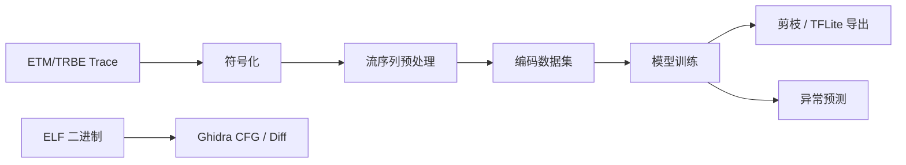

# ETM/TRBE 控制流异常检测

本项目把 ETM/TRBE Trace 转换为结构化控制流序列，训练下一跳预测模型，并通过低概率事件的滑动窗口统计检测异常。仓库同时包含基于 Ghidra/PyGhidra 的静态 CFG 提取与二进制差异分析工具。

## 数据流程



## 目录结构

```text
configs/                 默认运行配置
src/etm_flow/
  trace/                 ETM/TRBE 解码与符号化
  data/                  流序列预处理与数据集编码
  modeling/              训练、剪枝、推理、TFLite 导出和模型定义
tools/ghidra/             Ghidra/PyGhidra CFG 提取与二进制 Diff 工具
tests/                    不依赖大数据和模型文件的快速测试
docs/                     架构与维护文档
output/                   本地生成结果，不提交 Git
```

详细的模块边界和维护约定见 [docs/architecture.md](docs/architecture.md)。

## 安装

推荐使用 Python 3.9 以上版本和独立虚拟环境：

```bash
python -m venv .venv
```

激活环境后，根据用途安装：

```bash
# 完整开发环境：Trace 解析、TensorFlow 和测试工具
python -m pip install -e ".[trace,ml,dev]"
```

如果只处理已经生成的结构化数据，可以先安装基础包：

```bash
python -m pip install -e .
```

## 常用命令

```bash
# 1. 查看 Trace 符号化参数
etm-symbolize --help

# 2. 将符号化 JSONL 转换为连续控制流序列
etm-preprocess --input <symbolized.jsonl> --output-dir flow_preprocessed

# 3. 构建训练数据集
etm-build-dataset --input flow_preprocessed --recursive --output-dir flow_dataset

# 4. 训练与推理（默认读取 configs/default.yaml）
etm-train
etm-predict

# 5. 模型剪枝和便携 TFLite 导出
etm-compress
etm-export-tflite
```

配置中的相对路径均以执行命令时所在目录为基准，因此建议始终在仓库根目录运行命令。

## Ghidra 工具

Ghidra 工具需要 Bash 和 Ghidra/PyGhidra 环境。启动脚本与 Ghidra postScript 保持在同一目录：

```bash
tools/ghidra/run_cfg.sh import /path/to/app /path/to/app_cfg normal
tools/ghidra/run_diff.sh import /path/to/old_app /path/to/new_app /path/to/diff_output
```

可通过 `GHIDRA_HOME`、`PROJECT_DIR` 和 `PROJECT_NAME` 等环境变量覆盖默认设置，完整参数请运行脚本的 `--help`。

## 测试

```bash
python -m pytest
```

提交代码前至少运行快速测试和语法检查。数据集、模型、预测报告及 `output/` 都属于可重新生成的产物，不应提交到 Git。
