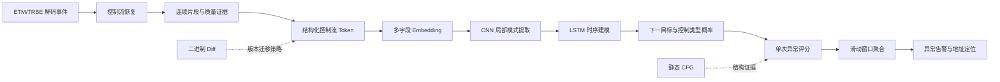

# ETM/TRBE 控制流异常检测：关键技术的意义、设计理由与作用

## 1. 文档目的

本文用于解释本项目各项关键技术“为什么需要、为什么这样设计、能够解决什么问题，以及为什么没有直接采用更简单的方案”。重点不是罗列处理步骤，而是说明从 ETM/TRBE Trace 到异常告警之间的设计逻辑。

本文涉及的主要模块如下：

1. Trace 控制流恢复；
2. 连续控制流片段切分与质量标记；
3. 结构化控制流 Token 与多字段 Embedding；
4. CNN-LSTM 下一跳预测模型；
5. 单次异常评分与滑动窗口告警；
6. 静态 CFG 对动态预测的增强；
7. 二进制 Diff 与版本更新感知。

需要特别说明：项目目前没有完整的攻击样本与对比实验数据。因此，本文对“降低误报、提高泛化能力”等内容的描述属于设计目标和技术推理，不能替代后续实验结论。

## 2. 整体技术逻辑



这条技术路线遵循三个原则：

- **先恢复语义，再训练模型。** 模型应学习程序执行行为，而不是学习 Trace 编码器何时输出某种包。
- **保留不确定性，不伪造确定答案。** 无法确认的目标、推测路径和丢包边界必须被显式标记并在损失或评分中正确处理。
- **概率模型与程序结构互补。** 动态模型学习“正常情况下通常怎么走”，静态 CFG 提供“结构上可能怎么走”。

---

## 3. 为什么需要复杂的 Trace 控制流恢复

### 3.1 为什么不能直接把解码后的 Address 包喂给模型

最直接的方案似乎是：把解码器输出的 Address 包看成地址序列，然后训练模型预测下一个地址。但 Address 包并不是完整的控制流序列，也不等价于“一次控制转移”。

ETM 为了减少带宽，不会为每条指令或每个直接分支都输出完整地址。解码结果中通常同时存在：

- Address：提供同步位置或间接目标等地址证据；
- ATOM：表示某些 waypoint 是否执行或分支是否被采用；
- Context：表示进程、线程或异常级等上下文变化；
- Exception、TraceOn、Overflow、Discard 等控制与不连续事件；
- Commit/Cancel 等与推测执行相关的信息。

因此，Address 包之间可能已经执行了多个基本块和多次控制转移。一个 Address 包可能是同步锚点、异常入口、间接跳转目标或恢复点，而不一定是普通的“下一跳”。如果直接把它们组成序列，模型看到的是“硬件选择在何时报告地址”，而不是程序真实的执行路径。

| 直接使用 Address 包的问题 | 对模型的影响 |
|---|---|
| Address 包是稀疏锚点，不覆盖全部控制转移 | 大量真实路径被跳过，序列语义不完整 |
| ATOM 中携带的条件分支结果没有展开 | 模型不知道实际选择了哪条分支 |
| 直接跳转目标本可由指令计算，但未必有独立 Address 包 | 模型丢失大量可确定的下一跳 |
| 返回和间接跳转需要结合地址证据或返回栈 | 单看 Address 无法确定其来源和控制类型 |
| Context、Trace Stream 或异常边界可能穿插其中 | 容易把不同执行上下文错误拼接 |
| 丢包和重新同步会造成地址跳变 | 模型可能把采集故障当成异常行为 |
| 绝对运行时地址受 ASLR 和加载基址影响 | 同一函数在不同运行中可能成为不同 Token |

复杂恢复的目的不是“还原尽可能多的指令文本”，而是构造可信的控制流事实：

```text
从哪里开始执行
    → 在哪里遇到控制指令
    → 控制转移属于什么类型
    → 实际或推测跳到哪里
    → 这段恢复结果有多可信
```

### 3.2 恢复过程实际上在做什么

项目使用可信 PC/Address 锚点确定起始位置，然后结合 ELF 指令、反汇编结果和 ATOM 顺序向前跟随：

1. 从已知 PC 开始顺序反汇编；
2. 普通指令继续执行到下一条；
3. 遇到条件分支时，由 ATOM 决定 taken 或 not-taken；
4. 遇到直接跳转或直接调用时，从指令立即数计算目标；
5. 遇到 BR、BLR、RET 等间接控制流时，等待 Address 包或使用软件返回栈形成暂定目标；
6. 后续 Address 证据可以确认或否定软件返回栈的推测；
7. 遇到上下文变化、异常、溢出或重新同步时，不继续跨边界拼接。

例如，下面的恢复不能仅靠 Address 包完成：

```text
Address = A
ATOM = E, N, E

A --顺序执行--> 条件分支1 --taken----> B
B --顺序执行--> 条件分支2 --not-taken-> C
C --顺序执行--> 直接跳转 -----------> D
```

Address 只提供起始锚点 A，三个具体控制转移需要结合指令语义与 ATOM 才能恢复。

### 3.3 为什么要记录恢复质量

Trace 恢复不可能在所有情况下都得到同等可靠的结果。项目因此保留：

- `target_valid`：目标是否可以作为真实监督标签；
- `control_valid`：控制类型和路径是否可信；
- `transition_valid`：当前行与上一行之间是否连续；
- `is_gap`：是否为显式流缺口；
- `confidence`、`target_source`、`reason`：恢复来源、可信度与失败原因。

这些字段的意义是避免两种极端：

- 把未知目标伪装成一个确定地址，污染模型；
- 把所有不完整片段全部丢弃，损失大量仍然有用的控制类型和局部路径证据。

当前数据集通过 sample weight 屏蔽无效监督：未知目标不参与 `next_dst_node` 损失，但可信的控制类型仍可参与 `next_ctrl_type` 训练；不连续转移和推测路径不会被当作正常的相邻边学习。

---

## 4. 为什么要切分连续控制流片段

模型的一个训练样本表示“根据同一段连续历史预测下一次控制转移”。因此，序列必须在以下情况切断或显式形成 gap：

- Context ID、异常级或相关上下文发生变化；
- Trace Stream 发生变化；
- Overflow、Discard、TraceOn 或重新同步；
- 异常进入、异常返回等控制边界；
- PC 无法连续对应；
- 目标模块发生变化且超出分析范围。

如果不切分，模型可能学习到如下伪关系：

```text
线程 A 的最后一个基本块 → 线程 B 的第一个基本块
丢包前的位置 → 重新同步后的随机位置
异常前的用户态代码 → 异常处理后的恢复位置
```

这些并不是真实控制流边，却会被模型视为正常训练样本。切分的核心作用是保护训练标签的因果含义。

项目还在每个编码片段之前插入 PAD 边界，窗口采样时不会跨越该边界，从数据加载阶段进一步保证不同片段不被连接。

---

## 5. 为什么采用结构化控制流 Token

### 5.1 当前 Token 表达的内容

每一次控制转移被建模为多字段 Token：

| 字段 | 含义 | 作用 |
|---|---|---|
| `src_module` | 源控制指令所属模块 | 区分主程序和共享库，并学习跨模块转移 |
| `src_ctrl_func` | 控制指令所属函数 | 定位真正触发转移的指令 |
| `src_ctrl_off` | 控制指令的函数内偏移 | 区分同一函数中的不同分支点 |
| `ctrl_type` | 分支、调用、返回及 ATOM/质量信息 | 描述发生了什么控制行为 |
| `dst_module` | 目标所属模块 | 区分库内和跨库控制流 |
| `dst_func` | 目标函数，stripped ELF 使用 `<elf>` | 因子化目标身份 |
| `dst_off` | 函数内偏移或模块相对 ELF 地址 | 保留 gadget 精确入口 |
| `icount` | 区间内指令数量的离散表示 | 描述路径长度和基本块规模 |

模型预测两个目标：

- `next_dst_node`：下一次控制转移将到达哪个节点；
- `next_ctrl_type`：下一次将发生哪种控制转移。

### 5.2 为什么不只使用一个目标地址

只使用地址会丢失控制转移的上下文。例如，同一个目标可能由调用、返回、条件跳转或间接跳转到达，这些行为的安全含义并不相同。

结构化 Token 可以区分：

```text
从哪个基本块出发
控制指令位于哪里
以什么方式转移
最终落到哪个节点
这段路径有多长
```

这会带来以下好处：

1. **语义更完整。** 模型学习的是控制流边，而不是孤立地址。
2. **异常可解释。** 低概率事件可以定位到函数、源控制指令、目标和控制类型。
3. **支持多任务学习。** 目标节点和控制类型相互补充，未知目标时仍可保留控制行为监督。
4. **能够描述局部路径形态。** `icount` 可以区分到达相同目标但执行区间长度不同的路径。

### 5.3 为什么使用“函数名 + 函数内偏移”

绝对运行时地址会随 ASLR、加载基址和链接布局变化。将地址归一化为：

```text
module / function + function_offset
```

可以让同一代码位置在不同运行中保持相对稳定，同时保留足够精细的定位能力。这种表示还便于版本 Diff 后执行旧节点到新节点的重映射。

它并不能自动解决所有版本差异：如果函数内部插入指令，函数内偏移仍会变化，因此版本迁移还需要基本块或指令级映射。

### 5.4 为什么每个字段使用独立 Embedding

如果把八个字段拼成一个巨大的字符串 Token，词表相当于所有字段组合的笛卡尔积，会产生严重的数据稀疏和 OOV 问题。

独立 Embedding 的做法是：

```text
函数字段 → Function Embedding
偏移字段 → Offset Embedding
目标节点 → Node Embedding
控制类型 → Control-type Embedding
指令数量 → Icount Embedding
             ↓
          拼接并投影到统一维度
```

其优势包括：

- 同一个函数可以在不同偏移和控制类型中共享函数语义；
- 新组合即使没有整体出现过，组成字段仍可能是已知的；
- 不同字段可以使用不同维度，控制模型规模；
- 每个字段的含义清楚，便于消融实验和版本迁移。

项目还加入可学习的位置 Embedding，使模型知道同一控制流 Token 位于 64 步历史窗口中的哪个相对位置。

---

## 6. 为什么选择 CNN-LSTM

### 6.1 当前架构

默认模型流程为：

```text
7 个字段输入
    ↓
独立 Embedding + 字段拼接
    ↓
Dense 投影到 128 维 + 位置 Embedding
    ↓
Conv1D(128, kernel=5) + MaxPool(2) + LayerNorm
    ↓
Conv1D(128, kernel=5) + MaxPool(2) + LayerNorm
    ↓
LSTM(128, return_sequences=True)
    ↓
LSTM(64)
    ↓
Dropout
    ↓
下一目标 Softmax + 下一控制类型 Softmax
```

默认历史长度为 64。两次步长为 2 的池化会把时间维从 64 压缩到约 16，再交给 LSTM 进行时序建模。

### 6.2 CNN 在这里解决什么问题

控制流中常出现短距离局部模式，例如：

- 函数入口后的检查—分支—调用；
- 调用—返回—继续执行；
- 循环体中的重复条件分支；
- 错误处理路径中的固定跳转组合。

一维卷积使用共享卷积核扫描相邻 Token，适合提取这些局部模式。其主要作用是：

- 把相邻几步组合成更高层的局部特征；
- 对局部位置变化具有一定容忍度；
- 通过池化缩短序列，降低后续循环计算量；
- 减少 LSTM 把容量消耗在重复局部细节上。

池化不是简单地“删除 48 个控制流事件”。卷积已经把局部窗口的信息编码到特征通道中，池化再对局部特征进行压缩。不过，池化仍可能损失精确时间位置，因此其大小需要通过实验验证。

### 6.3 LSTM 在这里解决什么问题

仅知道最近几条控制转移往往不够。同一个基本块可能出现在不同调用上下文或不同业务阶段，下一跳概率也不同。

LSTM 的输入门、遗忘门和输出门控制信息写入、保留和读取，使模型能够：

- 保留较早的函数调用或分支上下文；
- 忘记与当前预测无关的局部噪声；
- 根据当前 Token 和历史状态判断下一跳；
- 建模控制流的先后顺序，而不仅是局部组合是否出现。

项目使用单向 LSTM，因为在线异常检测只能利用已经发生的历史，不能读取未来控制流。

### 6.4 CNN 与 LSTM 组合的意义

二者形成分工：

```text
CNN：识别局部控制流“短语”
LSTM：理解这些短语在更长历史中的顺序和上下文
```

预期优势是：

- 同时覆盖局部模式和较长依赖；
- LSTM 处理的序列由 64 步缩短到约 16 步，计算更集中；
- 相比纯 LSTM，更容易先抽取重复局部结构；
- 相比纯 CNN，保留显式的时序记忆；
- 架构规模适中，适合作为后续剪枝和 TFLite 导出的工程基线。

必须强调：CNN-LSTM 是有合理归纳偏置的基线，并不能在没有实验的情况下宣称一定优于其他架构。

### 6.5 为什么不直接选择其他模型

| 模型 | 优势 | 本项目中的权衡 |
|---|---|---|
| 纯 LSTM | 结构直观，擅长顺序依赖 | 需要直接处理全部 64 步，可能把容量用于重复局部模式 |
| GRU | 参数更少、推理更快 | 门控表达略简化，是否足够需要对比实验 |
| TCN | 并行、稳定，扩张卷积可覆盖长感受野 | 依赖预设感受野，对状态式上下文的表达方式不同 |
| Transformer | 全局注意力、并行训练能力强 | 对数据规模和算力要求通常更高，短窗口下收益不一定抵消复杂度 |
| 纯 CNN | 推理高效、局部模式强 | 长距离顺序关系主要依赖堆叠深度和感受野 |

仓库已经提供 LSTM、GRU、TCN 和 Transformer 实现，合理做法是把 CNN-LSTM 作为主方案，并通过同一数据划分进行消融和基线比较。

---

## 7. 为什么使用概率异常评分

模型输出的是下一目标和下一控制类型的概率分布。对于真实发生的下一跳，可以取得模型赋予它的概率：

```text
p_dst  = P(真实目标 | 历史)
p_ctrl = P(真实控制类型 | 历史)
```

当前推理支持两种思路：

- 仅使用目标概率：`score_prob = p_dst`；
- 联合目标与控制类型：`score_prob = p_dst × p_ctrl^ctrl_weight`。

概率越低，说明真实发生的行为越偏离模型学习到的正常时序。为了便于数学分析，也可以写成负对数异常分数：

```text
anomaly_score = -log(score_prob)
```

使用真实下一跳概率，而不是只比较模型 Top-1 是否预测正确，有两个重要原因：

1. 程序在同一位置可能存在多个正常后继，Top-1 错误不等于异常；
2. 概率能够表达模型对真实目标的置信程度，便于设置连续阈值。

对于不连续转移或推测路径，项目不强行计算下一跳概率；目标未知但控制类型可信时，可以只使用控制类型概率作为有限证据。

---

## 8. 滑动窗口评分的意义与优势

### 8.1 当前告警逻辑

当前默认配置为：

```text
单项低概率阈值：0.1
滑动窗口大小：64
窗口内低概率数量阈值：5
窗口未满时默认不告警
```

每个可评分 Token 先判断是否低于概率阈值，再把结果放入固定长度窗口。当窗口中的低概率事件达到数量阈值时产生告警。

遇到目标行不连续、`transition_valid=false` 或不可评分事件时，窗口会清空，避免把不相关片段累计到同一次告警中。

### 8.2 为什么不以单个低概率事件直接告警

单个低概率事件可能来自：

- 合法但训练覆盖不足的稀有分支；
- 输入数据变化导致的正常路径；
- 间接控制流解析不完整；
- 模型校准误差；
- Trace 恢复过程中的局部不确定性。

攻击或显著异常更可能在短时间内造成一组连续或密集的低概率控制转移。滑动窗口因此把判断依据从“一个点是否异常”提升为“局部行为是否持续偏离”。

### 8.3 滑动窗口的主要优势

- **降低单点误报。** 一个罕见但合法的下一跳不会立即触发最终告警。
- **保留突发异常。** 多个低概率事件在局部聚集时仍能迅速达到阈值。
- **不要求严格连续。** 异常步骤之间夹杂少量正常步骤时仍可被累计。
- **在线计算简单。** 固定长度队列可以增量更新，内存和计算开销稳定。
- **定位范围明确。** 报告中包含窗口起止行、低概率数量、结束节点和结束概率，可回溯到具体函数与地址。
- **参数可解释。** “64 步中至少 5 个低概率事件”比复杂统计量更容易向使用者解释。

### 8.4 为什么不用其他评分方式

其他方法不是不能使用，而是当前方案在无攻击样本、需要在线部署和强调可解释性的阶段更容易落地。

| 评分方法 | 主要问题或权衡 |
|---|---|
| 单点概率阈值 | 对稀有正常路径和局部噪声过于敏感，误报风险高 |
| 连续 N 次低概率才告警 | 异常之间只要夹入一个正常事件就可能被打断，过于脆弱 |
| 窗口平均概率 | 大量高概率事件可能稀释少量但重要的异常事件 |
| 窗口最小概率 | 本质上仍接近单点判断，容易被一个极端值触发 |
| 累计负对数似然 | 能利用概率幅度，但阈值受序列长度和模型校准影响，需要更多验证 |
| EWMA / CUSUM | 适合长期漂移检测，但状态、基线和参数校准更复杂，定位解释不如计数窗口直接 |
| CFG 规则直接判定 | 静态 CFG 可能不完整，且“结构合法”不等于“运行时正常” |
| 监督攻击分类器 | 需要有代表性的攻击样本，当前数据条件不满足 |
| Autoencoder 重构误差 | 训练目标与“下一跳是否合理”不完全一致，也可能重构部分异常 |

窗口计数也有局限：它没有利用每个低概率事件的严重程度。例如概率 `0.099` 与 `0.000001` 都只计为一次。后续可以在保持可解释性的前提下，对比以下增强方法：

- 低概率计数 + 累计负对数概率；
- 不同控制类型采用不同权重；
- 对连续低概率事件给予额外权重；
- 使用验证集进行概率校准后再确定阈值。

---

## 9. 静态 CFG 为什么只能作为结构证据

动态模型回答的是：

> 根据之前的控制流历史，这个下一跳在正常运行中有多常见？

静态 CFG 回答的是：

> 根据静态分析，这个目标是否可能是当前控制指令的后继？

静态 CFG 不适合作为硬性白名单，原因包括：

- 间接跳转、虚调用和返回目标可能无法完全解析；
- 动态链接、异常路径或运行时生成目标可能不完整；
- 静态分析工具本身可能产生 partial 或 unresolved 结果；
- CFG 合法只表示结构上可能，并不表示运行时行为正常。

更合理的做法是联合模型概率与结构证据：

| 模型概率 | CFG 证据 | 建议解释 |
|---|---|---|
| 高 | 支持 | 高置信度正常下一跳 |
| 低 | 支持 | 可能是稀有但结构合法的路径，降低告警置信度 |
| 高 | 不支持或未知 | 可能是静态分析缺失、间接流未解析或版本不一致，需要复核 |
| 低 | 不支持 | 同时偏离动态规律和静态结构，异常证据最强 |

概念上可表示为：

```text
联合异常分数 = 概率异常 + λ × 结构异常
```

对于高置信度直接边，可以给予较强结构权重；对于 partial、unresolved 或间接控制流，只应给予弱惩罚或标记为未知，不能直接判定非法。

---

## 10. 二进制 Diff 与更新感知的意义

版本更新后，即使行为合法，函数地址、基本块偏移、指令数量和 CFG 边也可能变化。如果直接使用旧模型，新版本中的正常路径可能成为 OOV 或低概率事件，从而产生大量版本误报。

当前 `binary_diff.py` 已完成：

- 通过函数全名和签名匹配新旧函数；
- 使用布局、拓扑、助记符和指令 Hash 辅助比较；
- 映射基本块并识别移动、修改、新增和删除；
- 识别 CFG 边的新增、删除和类型变化；
- 输出函数、基本块和 CFG 边三级差异报告。

目前尚未完全实现的是“Diff 结果如何自动驱动模型迁移”。建议增加更新感知适配器：

| 变化类型 | 模型策略 |
|---|---|
| `UNCHANGED` | 复用词表、Embedding 和模型参数 |
| `LAYOUT_ONLY` | 建立旧节点到新节点映射，复制 Embedding，不重新训练 |
| `CONTENT_ONLY` | 保留结构知识，采集变更区域正常 Trace 并局部微调 |
| `CFG_CHANGED` / 新增节点 | 扩展词表、更新静态边、初始化新 Embedding、补采 Trace |
| 删除节点或边 | 停用旧 Token，过滤已失效旧样本，同时保留回滚能力 |
| `AMBIGUOUS` / 分析不完整 | 不自动迁移，进入未知区域并降低静态证据权重 |

建议增加两个中间产物：

1. `instruction_mapping.csv`：补足基本块内部控制指令偏移的映射；
2. `migration_manifest.json`：记录旧 Token、新 Token、变化类型、匹配置信度和迁移动作。

更新感知的核心不是让 Diff 直接修改预测概率，而是回答：

```text
哪些知识可以直接复用？
哪些节点只是换了地址？
哪些区域需要补充正常 Trace？
哪些区域必须重新学习或保守处理？
```

---

## 11. 当前方案的整体价值

将上述技术组合起来，可以形成不同层次的防护：

- Trace 恢复保证输入接近真实控制流，而不是稀疏包序列；
- 片段切分和质量标记避免错误监督污染训练；
- 结构化 Token 保留来源、类型、目标和路径长度语义；
- 多字段 Embedding 缓解组合词表稀疏问题；
- CNN-LSTM 同时建模局部控制流模式和较长时序上下文；
- 概率评分允许多个正常后继共存；
- 滑动窗口把偶发低概率与持续异常区分开；
- 静态 CFG 提供额外结构证据，但不把分析结果当成绝对白名单；
- 二进制 Diff 为跨版本知识复用和局部更新提供依据。

这些模块不是为了增加流程复杂度，而是分别解决 Trace 稀疏、地址不稳定、路径不连续、标签不可靠、行为多样、单点误报和版本漂移等不同问题。

---

## 12. 后续实验如何证明这些设计确实有效

在没有攻击样本时，首先可以验证模型是否学到了稳定的正常控制流，而不是直接宣称具备攻击检测效果。

建议进行以下消融实验：

1. Address 包序列 vs. 恢复后的控制流 Token；
2. 绝对地址 vs. 函数名加函数内偏移；
3. 单一目标节点字段 vs. 多字段 Token；
4. 纯 LSTM、GRU、TCN、Transformer vs. CNN-LSTM；
5. 单点阈值 vs. 滑动窗口计数；
6. 仅动态概率 vs. 动态概率与静态 CFG 联合评分；
7. 全量重训 vs. 二进制 Diff 驱动的局部迁移。

在正常数据上可以先观察：

- 下一目标 Top-k 准确率；
- 下一控制类型准确率；
- 负对数似然与概率校准；
- 每小时或每百万 Token 的误报数量；
- 不同丢包率下的稳定性；
- 新旧版本之间的词表覆盖率和节点映射率；
- 更新后达到稳定误报水平所需的正常 Trace 数量。

后续获得攻击或故障注入样本后，再增加：检测率、检测延迟、告警窗口定位精度，以及不同攻击强度下的 ROC/PR 指标。

只有通过这些对照实验，才能把本文中的“设计优势”进一步转化为可量化的项目结论。
